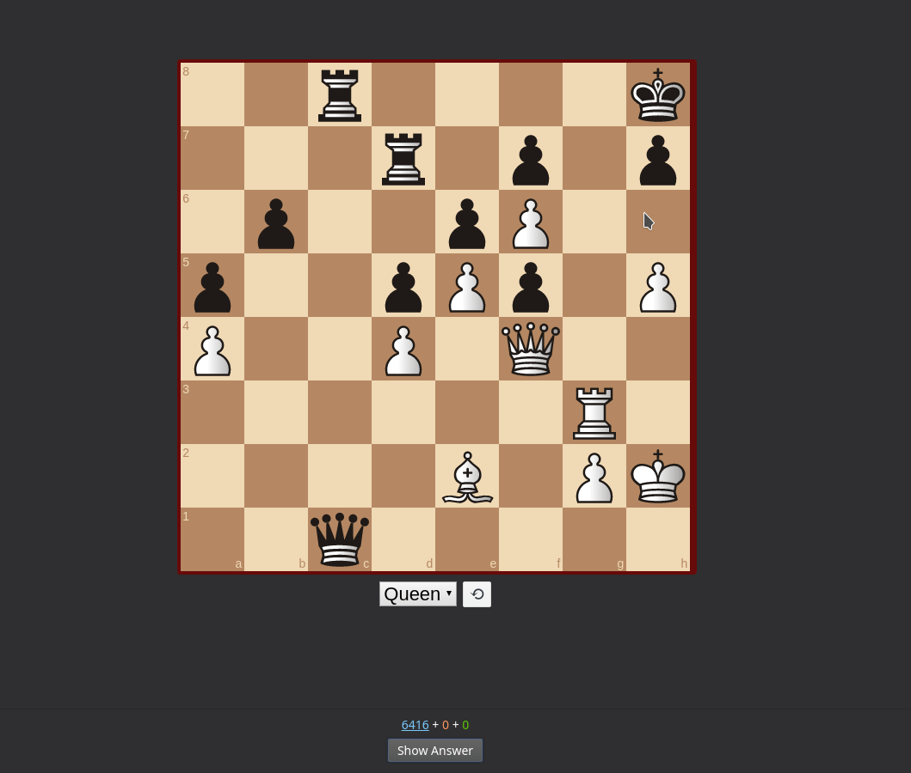

# Anki-Chess-2.0
An interactive chess template for anki. 

## Getting started

- Create a new note type and copy the relavent template frome the Templates folder of this repository into each section (Front Side, Backside, Styling). "Opponent Moves First" is for PGN puzzles that begin after the opponents move and "Opponest Moves First" is for PGN puzzles that begin on the first move. Styling is the same for both templtes.
- This note type should contain a field named PGN. 
- create a PGN puzzle using a PGN viewer, for example https://www.chess.com/analysis, and copy the PGN into the PGN field in anki.
- Done!

## resources used For this were:

#### ChessBoard js
https://chessboardjs.com/index.html

#### and the PGN viewer
https://github.com/mliebelt/PgnViewerJS

#### Auerswald Collection, 3500 tactics (PGN format)
http://gorgonian.weebly.com/pgn.html

#### chess.js
https://github.com/jhlywa/chess.js/blob/master/README.md

#### pgn-parser (much better than what I tried to write haha)
https://github.com/mliebelt/pgn-parser

